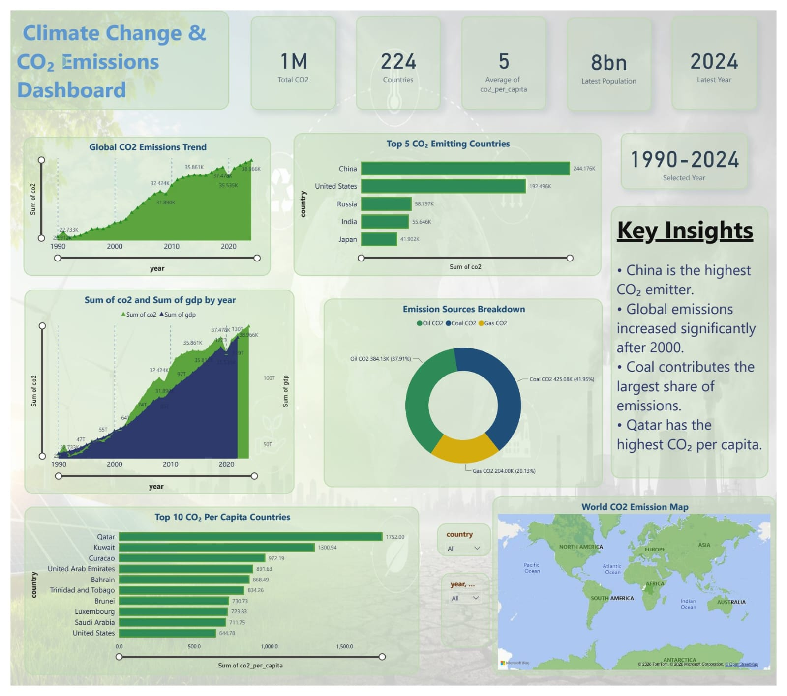
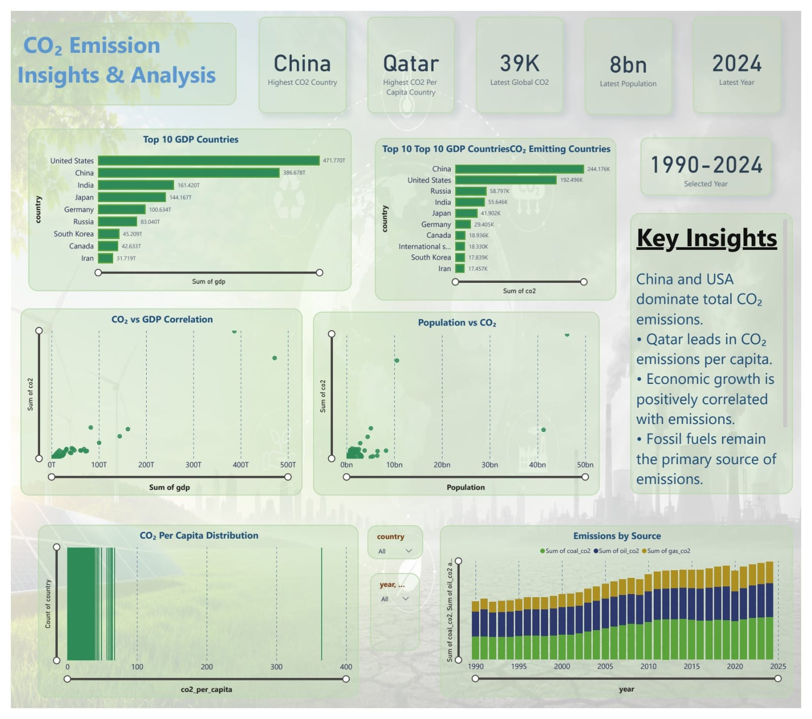

# 🌍 Climate Change & CO₂ Emissions Dashboard

## 📖 Project Overview

The Climate Change & CO₂ Emissions Dashboard is an interactive Power BI project developed to analyze global carbon emissions, population trends, economic indicators, and emission sources from 1990 to 2024.

This dashboard transforms climate-related data into meaningful visual insights, helping users understand emission patterns, identify major contributing countries, and explore the relationship between economic growth and environmental impact.

---

# 📊 Dashboard Preview

## Executive Overview Dashboard



## Deep Analysis Dashboard



---

# 🎯 Objectives

- Analyze global CO₂ emission trends over time.
- Identify top CO₂-emitting countries.
- Compare emissions from Coal, Oil, and Gas sources.
- Examine CO₂ emissions per capita.
- Explore the relationship between GDP and CO₂ emissions.
- Analyze the impact of population growth on emissions.
- Visualize global emissions geographically.
- Generate meaningful climate insights through interactive dashboards.

---

# 📈 Dashboard Features

## Page 1 – Executive Overview

### KPI Cards
- Total CO₂ Emissions
- Total Countries Covered
- Average CO₂ Per Capita
- Latest Global Population
- Latest Available Year

### Visualizations
- Global CO₂ Emissions Trend (1990–2024)
- Top 5 CO₂ Emitting Countries
- CO₂ Emission Sources Breakdown
- GDP vs CO₂ Trend Analysis
- Top 10 CO₂ Per Capita Countries
- Interactive World CO₂ Emission Map
- Dynamic Country & Year Filters

---

## Page 2 – Insights & Analysis

### KPI Cards
- Highest CO₂ Emitting Country
- Highest CO₂ Per Capita Country
- Latest Global CO₂ Emissions
- Latest Population
- Latest Available Year

### Visualizations
- Top GDP Countries
- Top CO₂ Emitting Countries
- GDP vs CO₂ Correlation Analysis
- Population vs CO₂ Analysis
- Emissions by Source Over Time
- Climate Insights Panel

---

# 🔍 Key Insights

- China is the largest contributor to global CO₂ emissions.
- Qatar records one of the highest CO₂ emissions per capita.
- Global carbon emissions have increased significantly since 2000.
- GDP growth shows a positive relationship with CO₂ emissions.
- Fossil fuels remain the primary source of global emissions.
- Population growth continues to influence environmental pressure and carbon output.

---

# 🛠️ Tools & Technologies

- Microsoft Power BI
- Power Query
- DAX (Data Analysis Expressions)
- Data Modeling
- Data Visualization
- Interactive Dashboard Design

---

# 📂 Repository Structure

```text
Climate-Change-CO2-Emissions-Dashboard
│
├── Dashboard.pbix
├── climate_change_dataset.zip
├── README.md
├── image1.png
└── image2.png
```

---

# 💡 Skills Demonstrated

- Data Cleaning & Transformation
- Data Modeling
- DAX Measures
- Dashboard Development
- Data Visualization
- Business Intelligence
- Climate Data Analytics
- Data Storytelling

---

# 🚀 Future Improvements

- CO₂ Emission Forecasting using Machine Learning
- Renewable Energy Analysis
- Real-Time Climate Data Integration
- Advanced Sustainability Metrics
- Carbon Footprint Prediction Models

---

# 👨‍💻 Author

**Sohaib Sulman**

MS Data Science – FAST National University of Computer and Emerging Sciences (FAST-NUCES), Islamabad
---

⭐ If you found this project useful, consider giving the repository a star.
